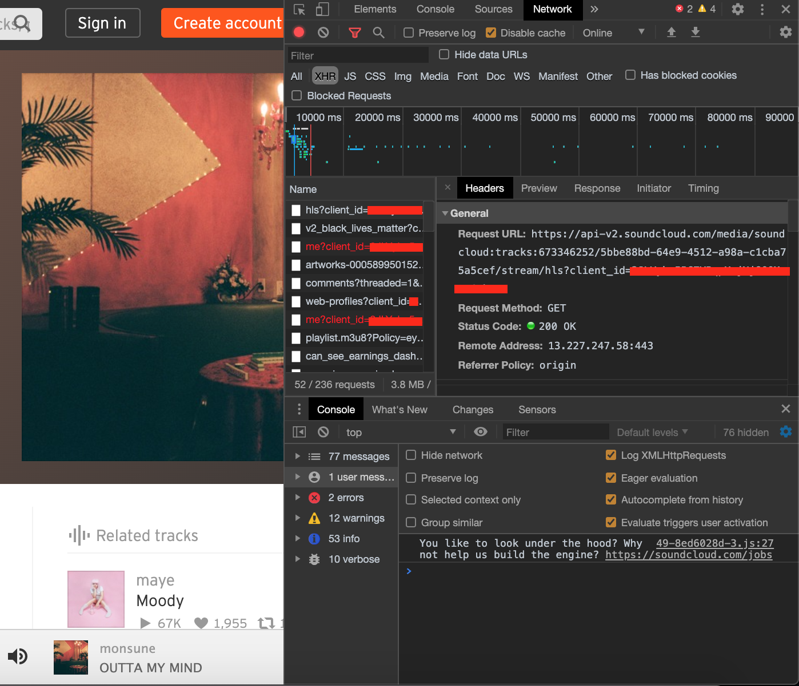

# Desktop Soundcloud App

## **Warning!** 
**This software is work-in-progress**

**Since this app is using soundcloud's public api (because it stopped giving away API keys and I basically had to reverse-engineer it), many features can not be implemented, such as:**

- Liking a song
- Official auth with soundcloud
- etc.

The list will be updated as development continues

## Features
- Liked songs
- Weekly Playlist
- Shuffle
- Native Media Controls

To see next planned feature check out my [todos](./TODO.md)

## Requirements
- Rust 1.68.2
- Node ^18.0.0


## Usage
```shell
$ npm i
$ npm run tauri dev
```

## Client ID
You can obtain a Client ID by visiting the Soundcloud website and inspecting network traffic (perhaps with Chrome DevTools or some HTTP proxy software) and looking for any requests to the Soundcloud API. Ex:
```
https://api-v2.soundcloud.com/me/play-history/tracks?client_id={CLIENT ID IS HERE}&limit=25&offset=0&linked_partitioning=1&app_version=1590494738&app_locale=en
```

Here is a picture of where you should be able to find it:


## Note
`Not tested on windows`